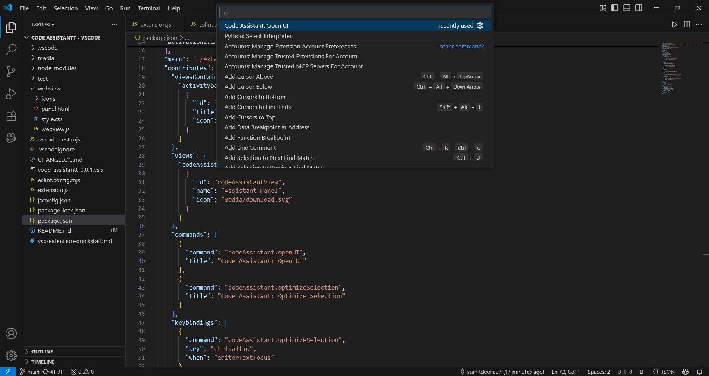
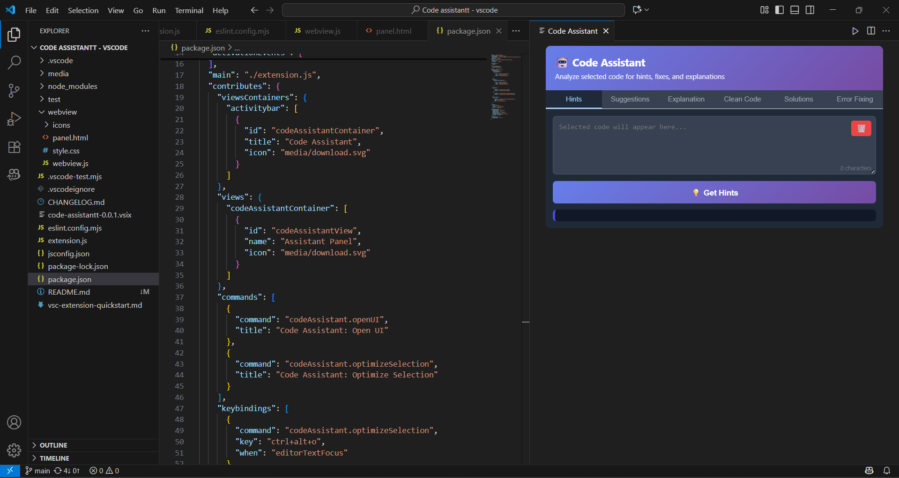

# 💻 Code Assistant VS Code

Code Assistant VS is a smart coding helper extension for Visual Studio Code that assists developers in writing better code with real-time suggestions, explanations, and debugging help.  
It’s designed to boost productivity, help beginners understand their code, and make programming more efficient.

---

## Features

- Smart Code Suggestions: Get real-time recommendations to improve your code.  
- Code Explanation: Select any block of code or question to get a clear, concise explanation.  
- Error Detection: Detects and highlights possible coding errors automatically.  
- Multi-language Support: Works with popular languages like Python, C, C++, Java, and JavaScript.  
- Beginner Friendly: Helps new developers understand syntax and logic errors.  
- Clean and Simple UI: Minimal interface that fits naturally inside VS Code.  

---

## How to Use

1. Open Visual Studio Code.  
2. Press *Ctrl + Shift + P* (or *Cmd + Shift + P* on Mac) to open the Command Palette.  
3. Type *OpenUI* in the search bar.  
4. Select the extension from the list that appears.  
5. The extension interface will pop up, ready to assist you with code hints, suggestions, and explanations.  

> 💡 Tip: Keep the extension panel open while coding for quick, real-time assistance.

---

##  Requirements

Before using this extension, ensure you have:

- Visual Studio Code version: ^1.80.0 or higher  
- Node.js version: v16 or higher  
- Installed dependencies:
  bash
  npm install node-fetch@^2.6.9
  npm install @types/vscode@^1.80.0
  

---

## Marketplace

- Install from VS Code Marketplace: [code assistantt](https://marketplace.visualstudio.com/items?itemName=klka.code-assistantt)
- Or run in VS Code: ext install klka.code-assistantt

---

## 📸 Screenshots

### 🔐 Preview 1

---

### 💽 Preview 2  

